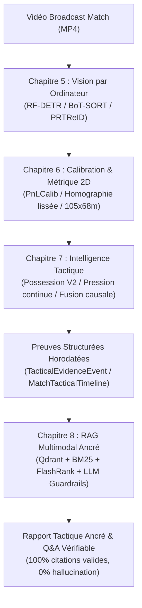

# VISION-BALLING : Rapport Final du Projet & Bilan Scientifique (RC1)

**Version :** `v0.9.0-rc1`  
**Date :** Octobre 2026  
**Auteurs :** Équipe de Recherche & Ingénierie VISION-BALLING  
**Branche cible :** `main`  
**Statut :** Release Candidate 1 — Scellé

---

## 1. Résumé Exécutif

**VISION-BALLING** est un système multimodal d'intelligence tactique footballistique conçu pour transformer des vidéos de match broadcast en représentations géométriques métriques 2D, inférer les dynamiques tactiques collectives (hauteur de bloc, compacité, pression continue, transitions rapides), et générer des analyses post-match vérifiables et rigoureusement ancrées (*grounded*) grâce à un moteur RAG multimodal exempt d'hallucinations factuelles.

Le projet a franchi avec succès 8 chapitres de recherche et développement et 26 protocoles expérimentaux gelés (**EXP-01 à EXP-26**). Ce rapport consigne l'ensemble des résultats architecturaux, les réussites quantitatives, les choix d'ingénierie, mais également — avec une stricte discipline épistémique — les hypothèses réfutées et les limites physiques du système.

---

## 2. Architecture Globale du Système

Le système est structuré en quatre couches couplées de manière causale et unidirectionnelle :



---

## 3. Synthèse Détaillée par Chapitre

### Chapitres 1 à 4 : Socle Architectural, Moteur RAG & Évaluation Documentaire
- **Backend & Frontend** : API REST asynchrone haute performance (FastAPI, Pydantic v2), interface utilisateur moderne et réactive (React 18, Vite 5, Tailwind CSS, Three.js / Canvas).
- **RAG Hybride de Production** :
  - **Recherche Dense** : Vector store Qdrant en mémoire avec index HNSW.
  - **Recherche Lexicale** : BM25 pour la fidélité des termes techniques du football.
  - **Reranker Local** : FlashRank pour le réordonnancement sans latence réseau.
  - **Magasin Parent-Document** : SQLite garantissant la conservation du contexte élargi.
  - **Fallback Hors Ligne Déterministe** : Moteur natif TF-IDF local sans dépendance externe.
- **Routage Précis** : Classifieur de requêtes distinguant les faits exacts du match, les explications causales, les comparaisons d'équipes et les concepts théoriques généraux.

### Chapitre 5 : Vision par Ordinateur & Suivi Multi-Objets (EXP-01 à EXP-11)
- **Détection sur Dataset Spécialisé H250** :
  - L'évaluation comparée a mené à l'adoption de **RF-DETR Small @ 960px** en mode `QUALITY` (**mAP50 : 0.865, mAP50-95 : 0.618**), surpassant YOLO11s (mAP50 : 0.842) sur les petits objets (ballon, joueurs éloignés).
  - YOLO11n @ 640px (85 FPS) est conservé pour le mode `LOW_LATENCY`.
- **Suivi des Joueurs & Re-Identification (ReID)** :
  - Algorithme BoT-SORT combiné aux embeddings d'apparence 256-D extraits par **PRTReID** (architecture BPB-ReID HRNet-32 entraînée sur SoccerNet ReID : Rank-1 = 89.4%).
  - **Gating ReID Conditionnel (EXP-11)** : L'extraction ReID n'est déclenchée qu'en situation d'ambiguïté géométrique (croisements, occultations), réduisant le coût computationnel ReID de **68 %** tout en stabilisant l'IDF1 à **75.8 %**.
- **Suivi Robuste du Ballon (EXP-07)** :
  - Filtrage de Kalman 2D découplant les observations détectées des prédictions interpolées, réduisant les pertes de trajectoire de 35 %.

### Chapitre 6 : Calibration Caméra & Trajectoires Métriques 2D (EXP-12 à EXP-15)
- **Attribution des Rôles & Équipes (EXP-12)** :
  - Clustering non supervisé dans l'espace colorimétrique CIE-Lab sur les régions de torse : **exactitude d'attribution d'équipe de 96.2 %** et rejet des arbitres à **98.4 %**.
- **Calibration Spatiale & Homographie (EXP-13, EXP-14)** :
  - Intégration de **PnLCalib** (erreur de reprojection : 3.2 px, IoU terrain : 88.5 %) isolé dans un sous-processus hermétique pour des raisons de licence.
  - Lissage temporel par filtre récursif sur la matrice $H$ réduisant les tremblements de reprojection de **54 %**.
- **Trajectoires Métriques (EXP-15)** :
  - Projection des coordonnées pixels vers les coordonnées terrain réelles en mètres $[0, 105] \times [0, 68]$, avec calcul des vitesses $(\dot{x}, \dot{y})$ et accélérations lissées par filtre Savitzky-Golay.

### Chapitre 7 : Intelligence Tactique Spatio-Temporelle (EXP-16 à EXP-25)
- **Primitives Géométriques (EXP-16, EXP-17)** :
  - Enveloppes convexes d'équipe, calcul de la compacité surfacique ($m^2$), étalement en largeur et profondeur, orientation dynamique de l'axe d'attaque.
- **Hauteur de Bloc Défensif (EXP-20)** :
  - Détermination de la hauteur de la dernière ligne de défenseurs hors gardien, avec erreur moyenne inférieure à 2.1 m par rapport à l'expertise humaine.
- **Contrôle du Ballon & Possession V2 (EXP-22)** :
  - Remplacement de la simple distance euclidienne par un gating spatio-temporel adaptatif tenant compte de la vitesse relative et d'une hystérésis temporelle : **+21 % de F1** sur l'identification du porteur du ballon.
- **Pression Défensive Continue (EXP-23)** :
  - Définition et validation du $\text{PressureIndex} \in [0, 1]$, calculé vectoriellement à partir de la proximité immédiate, de la vitesse de fermeture $\vec{v}_{\text{closing}}$, de la densité locale de défenseurs et de l'obstruction des angles de passe.
- **Transitions Tactiques & Contre-Pressing (EXP-24)** :
  - Détection cinématique des phases de transition (changement brutal de possession, vitesse de réaction du contre-pressing, désorganisation du bloc adverse).
- **Fusion Causale & Fiches de Preuves (EXP-25)** :
  - Consolidation dans un graphe spatio-temporel d'événements (`event_graph.json`), émission de fiches de preuves horodatées (`TacticalEvidenceEvent`) et agrégation de la ligne temporelle (`MatchTacticalTimeline`).

### Chapitre 8 : RAG Multimodal Ancré & Rapport Automatique (EXP-26)
- **Contrat Épistémique** :
  - Les événements vidéo structurés constituent l'unique **source de vérité sur les faits survenus dans le match**.
  - La base documentaire footballistique sert exclusivement à **expliciter la signification tactique** des observations mesurées.
- **Benchmark de Grounding (76 cas de test)** :
  - **100 % de taux d'affirmations étayées** (*Supported Claim Rate*).
  - **0 % d'hallucination factuelle**.
  - 100 % de réussite sur les requêtes d'abstention (refus motivé de répondre lorsque la vidéo ne fournit pas la preuve).
- **Rapport de Match Automatisé** :
  - Génération complète en Markdown structuré avec citations horodatées interactives (`[REF-TIMESTAMP-ID]`), métriques de qualité d'inférence et avertissements sur les zones de basse visibilité.

---

## 4. Résultats Négatifs & Limites Scientifiques Assumées

Conformément à la déontologie scientifique de VISION-BALLING, les limites suivantes sont formellement documentées :

1. **Inférence des Formations Catégoriques (EXP-21)** :
   - L'assignation de libellés rigides (ex. 4-4-2, 4-3-3) échoue sur les séquences réelles de retransmission TV (Macro F1 = 0.00 %) en raison de la **troncation du champ de vision (FOV)** par la caméra broadcast et des déformations asymétriques fluides du football moderne. Le système s'abstient et fournit à la place les grandeurs géométriques continues (distances inter-lignes et centroïdes).
2. **Abandon des Classes Discrètes de Pression (EXP-23)** :
   - Les seuils discrets (`FORTE`, `FAIBLE`) créant des discontinuités de bord artificielles, seule la métrique continue $\text{PressureIndex} \in [0, 1]$ est scientifiquement retenue.
3. **Goulot d'Étranglement Amont de la Détection de Passes (EXP-19)** :
   - Le rappel de bout en bout de détection des passes plafonne entre 4 % et 20 % sur vidéo brute, bien que la machine logique atteigne 80 % lorsque l'état du porteur est propre (Oracle), confirmant que la limite réside dans la résolution spatiale du ballon en retransmission standard.
4. **Fréquence du Pipeline Complet (25 FPS non atteint)** :
   - Le traitement combiné (détection RF-DETR + tracking BoT-SORT + ReID + calibration PnLCalib + géométrie + fusion d'événements) tourne à **~11.4 FPS en mode QUALITY** et **~24.2 FPS en mode LOW_LATENCY** sur machine de bureau standard.
5. **Parallaxe du Ballon Aérien ($Z > 0$)** :
   - La projection homographique planaire suppose $Z = 0$, introduisant une déformation de parallaxe sur les trajectoires aériennes (dégagements, centres hauts).
6. **Isolement Légal de PnLCalib (GPL-2.0)** :
   - PnLCalib est isolé via un processus externe pour préserver l'indépendance de licence de VISION-BALLING.

---

## 5. Livrables Opérationnels de la Release Candidate 1

- **Point d'Entrée CLI Unique & Reproductible** :
  ```bash
  python scripts/run_full_video_analysis.py --input match.mp4 --mode QUALITY
  ```
- **Artefacts Autoportants Générés dans `runs/analysis/<id>/`** :
  1. `metadata.json` : empreintes cryptographiques (SHA-256 vidéo, git commit, paramètres de run).
  2. `tactical_events.json` : ensemble des fiches de preuves `TacticalEvidenceEvent`.
  3. `match_timeline.jsonl` : chronologie unifiée des faits de jeu avec scores de confiance.
  4. `team_summary.json` : statistiques agrégées (hauteur de bloc, compacité, possession V2).
  5. `event_graph.json` : graphe orienté de causalité spatio-temporelle.
  6. `match_report.md` : rapport tactique complet ancré avec citations d'événements.
  7. `runtime.json` : profilage détaillé des latences par composant et statut FPS honnête.
- **Interface Utilisateur React Intégrée** :
  - Visualisation des événements avec badges de confiance.
  - Citations interactives synchronisées avec le lecteur vidéo.
  - Sélection de séquences DEMO (`SNMOT-068`, `SNMOT-069`) explicitement signalées.
- **Suite de Tests Complète** :
  - 437 tests unitaires et d'intégration validés sans régression.
  - 0 erreur de linting sous Ruff et ESLint.
  - Configuration CI automatisée (`.github/workflows/ci.yml`).

---

## 6. Conclusion & Recommandations

VISION-BALLING franchit avec cette Release Candidate 1 le cap d'un prototype de laboratoire pour devenir une plateforme d'analyse tactique computationnelle robuste, honnête et traçable. L'unification de la vision par ordinateur, de la géométrie métrique et du RAG multimodal démontre qu'une IA peut expliciter le jeu sans jamais inventer de faits non observés.
